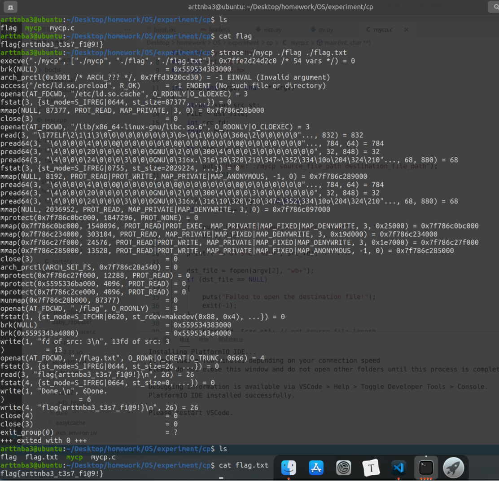

# 实验一、系统调用基础

## 一、实验题目

In Section 2.3, we described a program that copies the contents of one file

to a destination file. This program works by first prompting the user for

the name of the source and destination files. Write this program using

either the Windows or POSIX API. Be sure to include all necessary error

checking, including ensuring that the source file exists.

Once you have correctly designed and tested the program, if you

used a system that supports it, run the program using a utility that traces

system calls. Linux systems provide the strace utility, and Solaris and

Mac OS X systems use the dtrace command. As Windows systems do

not provide such features, you will have to trace through the Windows

version of this program using a debugger.

## **二、相关原理与知识**

**（完成实验所用到的相关原理与知识）**

Linux 系统调用相关基础知识

Linux C 文件读写相关基础知识

**strace的使用**

## **三、实验过程**

**（清晰展示实际操作过程，相关截图及解释）**

**为了模拟cp命令，我们主要通过命令行来传递参数，对于参数数量不符合的输入则直接终止程序。**

 ```c
if (argc != 3)
{
	puts("Usage: ./mycp source_file_path destination_file_path");
	 exit(0);
}
 ```

对于要被拷贝的源文件，比较常规的思路是逐字节读入，若是读到 EOF 则说明读取到了文件末尾；但是在 Linux 下我们可以直接使用 fstat() 函数将一个文件的所有相关信息记录到一个stat结构体中，通过其st_size成员直接获取其长度，之后就可以直接通过 read(fd, buf, st.st_size) 读入文件内容。

 ```c
src_fd = open(argv[1], O_RDONLY);

if (src_fd == -1)
{
    puts("Failed to open the source file!");
    exit(-1);
}

printf("fd of src: %d\n", src_fd);

 
fstat(src_fd, &src_st); // get source file length

buf = (char*) malloc(sizeof(char) * src_st.st_size);

if (buf == NULL)
{
   puts("Malloc error!");
   exit(-1);
} 

read(src_fd, buf, src_st.st_size);
 ```

写入文件则可以通过 fwrite 完成，相比起我们手动通过文件描述符对文件进行操作而言，由glibc封装的相关文件操作更为方便，这里便不再赘叙。需要注意的便是在程序结束时别忘了关闭对应的文件流。

```c
fwrite(buf, sizeof(char), src_st.st_size, dst_file);

 
puts("Done.");

fclose(dst_file);
close(src_fd);
```

## 四、**实验结果与分析**

由图上我们可以看出在进入到我们的主函数main之前程序首先先通过 mmap 系统调用将ld与libc等文件都映射到该进程的内存空间中，并使用mprotect()函数修改各数据段的读写执行权限，这些操作按照笔者的推测应当是由操作系统来完成的

接下来才是我们的程序的执行流程，我们可以看到虽然我们使用的是open()函数来打开目标文件，但是其所使用的系统调用为openat（系统调用号257）而不是open（系统调用号3），这是由于我们所传入的路径为相对路径而非绝对路径的原因，对于绝对路径openat会退化为open，不过并非本篇重点这里暂且不赘叙；随后我们的程序通过fstat系统调用获取到文件相关信息

接下来我们的程序使用write系统调用向stdout（文件描述符1）写入内容，在这里我们可以看出 printf 内部会真正用到的系统调用为write，且传递给系统调用的字符串为经过参数代换后的格式化字符串。

接下来我们可以看到，在fopen()函数创建文件时不仅会使用 openat 系统调用创建文件，还会使用fstat系统调用获取文件的相关信息；在这里笔者的程序虽然设定是先写入文件再输出 ”Done.” 字符串，但是从strace的结果来看似乎并非如此，笔者推测是由编译器将这个流程进行了优化。

最后便是关闭文件流，在这里虽然笔者分别使用了 “close() 关闭文件描述符”与“fclose()关闭FILE指针”这两种操作，但是我们不难看出其背后所使用的都是“通过close 系统调用关闭文件描述符”这一方法



