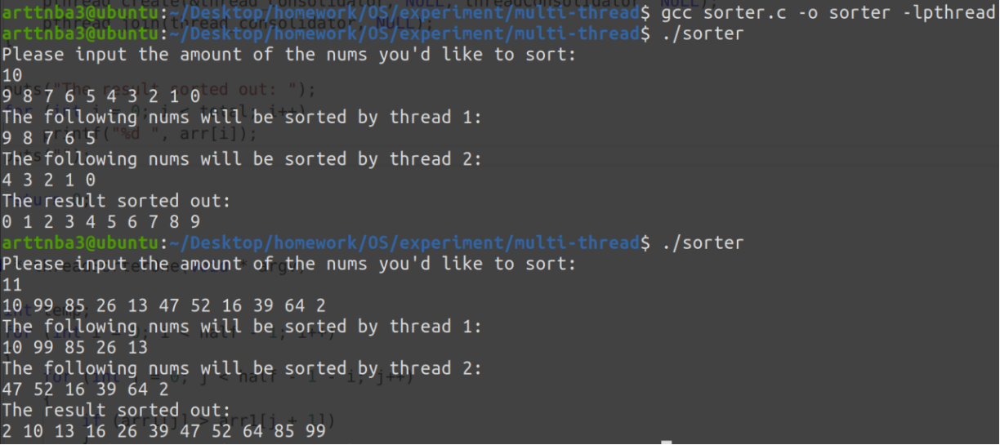
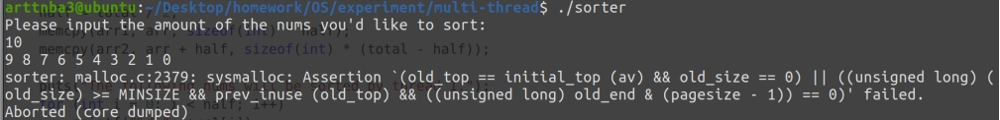

# 实验三、**多线程编程**

## **一、实验题目**

Project 2—Multithreaded Sorting Application

Write a multithreaded sorting program that works as follows: A list of integers

is divided into two smaller lists of equal size. Two separate threads (which we

will term sorting threads) sort each sublist using a sorting algorithm of your

choice. The two sublists are then merged by a third thread—a merging thread

—which merges the two sublists into a single sorted list.

 

Because global data are shared cross all threads, perhaps the easiest way

to set up the data is to create a global array. Each sorting thread will work on

one half of this array. A second global array of the same size as the unsorted

integer array will also be established. The merging thread will then merge

the two sublists into this second array. Graphically, this program is structured

according to Figure 4.20.

 

This programming project will require passing parameters to each of the

sorting threads. In particular, it will be necessary to identify the starting index

from which each thread is to begin sorting. Refer to the instructions in Project

1 for details on passing parameters to a thread.

The parent thread will output the sorted array once all sorting threads have exited.

## **二、相关原理与知识**

**（完成实验所用到的相关原理与知识）**

Linux 多线程编程

Linux 下的 C 编程

Linux 线程相关知识

**Pthread库的使用**

## **三、实验过程**

**（清晰展示实际操作过程，相关截图及解释）**

### 基本架构设计

题目的要求大概是需要我们将一个数组均分为两部分，随后再分别使用两个线程对这两部分进行排序，最后再由第三个线程对两部分的排序结果进行合并。

由于用户输入的数据的数量不定，在这里可以选择使用动态内存分配的方式来存储用户输入的数据。

```c
	puts("Please input the amount of the nums you\'d like to sort:");
    scanf("%d", &total);
    if (total < 1)
    {
        puts("Invalid input!");
        exit(-1);
    }

    arr = (int*) malloc(sizeof(int) * total);
    if (arr == NULL)
    {
        puts("Error in malloc!");
        exit(-1);
    }

    for (int i = 0; i < total; i++)
    {
        scanf("%d", arr + i);
    }
```

我们的主线程应当完成读入用户输入数据的任务，两个用以进行排序的线程应当在读完输入后由主线程启动，对于一些特殊的输入数据（例如用户只输入了一个数）进行特殊处理

```c
	if (total != 1)
    {
        arr1 = (int*) malloc(sizeof(int) * total);
        arr2 = (int*) malloc(sizeof(int) * total);
        half = total / 2;
        memcpy(arr1, arr, sizeof(int) * half);
        memcpy(arr2, arr + half, sizeof(int) * (total - half));

        puts("The following nums will be sorted by thread 1:");
        for (int i = 0; i < half; i++)
            printf("%d ", arr1[i]);
        puts("");

        puts("The following nums will be sorted by thread 2:");
        for (int i = 0; i < total - half; i++)
            printf("%d ", arr2[i]);
        puts("");

        pthread_create(&thread_sorter_1, NULL, threadSorterOne, NULL);
        pthread_create(&thread_sorter_2, NULL, threadSorterTwo, NULL);
        pthread_join(thread_sorter_1, NULL);
        pthread_join(thread_sorter_2, NULL);

        pthread_create(&thread_consolidator, NULL, threadConsolidator, NULL);
        pthread_join(thread_consolidator, NULL);
    }
```

最后的第三个用以整合的线程同样由主线程启动，主线程应当等待两个排序子线程全部完成后再启动第三个线程，最后等待第三个线程合并结束后输出最终的结果

```c
void * threadConsolidator(void * argv)
{
    for (int i = 0, j = 0, ptr = 0; i != half || j != (total - half);ptr++)
        arr[ptr] = ((i != half )? ((j != (total - half)) ? (arr1[i] < arr2[j] ? arr1[i++] : arr2[j++]) : arr1[i++]) : arr2[j++]);
    pthread_exit(0);
}
```

> 这一段代码纯属写着玩的，这种写法好孩子不要学！

## 四、**实验结果与分析**

经过测试，我们的程序成功地将用户的输入分成两部分进行排序，并最终合并，所得排序结果无异常



## 五、问题总结**

**唯一遇到的问题便是在循环中一不小心将 arr + i 写成了 arr + total ，导致读入数据时覆写到了下一个物理相邻 chunk 的size域，读入10 个数时刚好覆写到了 top chunk 的 size 域，由此在第二次 malloc 时触发了 ptmalloc2 的安全检查导致程序 abort**

 

**将其改正后无其他问题出现**