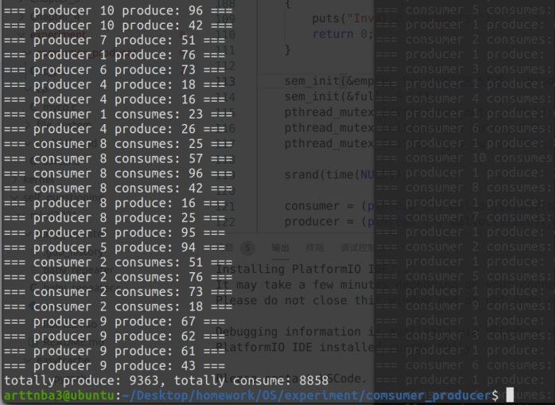
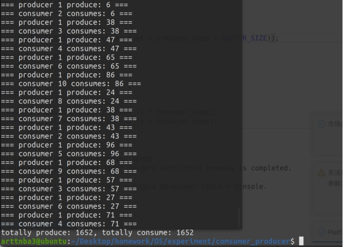

# 实验四、**多线程与信号量编程**

## **一、实验题目**

In Section 5.7.1, we presented a semaphore-based solution to the producer– consumer problem using a bounded buffer. In this project, you will design a programming solution to the bounded-buffer problem using the producer and consumer processes shown in Figures 5.9 and 5.10. The solution presented in Section 5.7.1 uses three semaphores: empty and full, which count the number of empty and full slots in the buffer, and mutex, which is a binary (or mutualexclusion) semaphore that protects the actual insertion or removal of items in the buffer. For this project, you will use standard counting semaphores for empty and full and a mutex lock, rather than a binary semaphore, to represent mutex. The producer and consumer—running as separate threads—will move items to and from a buffer that is synchronized with the empty, full, and mutex structures. You can solve this problem using either Pthreads or the Windows API.

## **二、相关原理与知识**

**（完成实验所用到的相关原理与知识）**

**临界区段问题相关原理**

**基本数据结构知识**

**Linux 多线程编程**

**Linux 信号量与互斥锁**

**Linux C编程**

## **三、实验过程**

**（清晰展示实际操作过程，相关截图及解释）**

大概是要我们编程模拟生产者-消费者问题，在这里我们首先使用一个循环队列用以表示一个共享资源区。

```c
#define BUFFER_SIZE 0x100

int items_queue[BUFFER_SIZE];
int front = 0, end = 0;
```

同时我们还需要设置相应的信号量与互斥锁，在这里我们将其设置为全局变量，其中empty与full使用信号量标识：在这里若是生产者数小于队列大小则将empty信号量的数量初始化为生产者数，否则初始化为队列大小，而full信号量的数量则初始化为0；队列相关操作则使用一个互斥锁标识即可保证线程安全。

```c
sem_t empty, full;
...
sem_init(&empty, 0, (BUFFER_SIZE > producer_nums ? producer_nums : BUFFER_SIZE));
sem_init(&full, 0, 0);
```

设置对应的向队列中插入、从队列中取出item的函数，在这里笔者选择将多线程相关操作放在其上层调用函数中，因此这两个函数并未设置相应的信号量、互斥锁等的判断

```c
void insertItem(int item)
{
    items_queue[front++] = item;
    front %= BUFFER_SIZE;
}

int removeItem(void)
{
    end %= BUFFER_SIZE;
    return items_queue[end++];
}
```

接下来设计producer线程：先获取empty的信号量，获取成功后接下来我们使用一个随机数进行判断：奇数为睡眠，偶数为生产：若为生产操作则获取互斥锁后向队列中插入数据，最后增加一个full信号量；在这里由于empty信号量被初始化为适当的大小，因而producer一开始就会工作，但是不会发生溢出的情况

```c
void * producerThread(void * args)
{
    int thread_no, item;

    pthread_mutex_lock(&pro_no_mutex);
    thread_no = ++producer_no;
    pthread_mutex_unlock(&pro_no_mutex);

    while (1)
    {
        if (rand() % 2)
        {
            sleep(rand() % 10); // avoid sleeping for tooooooooo long
        }
        else
        {
            sem_wait(&empty);
            pthread_mutex_lock(&queue_mutex);
            do
            {
                item = rand() % 100; 
            } while (item == 0); // it's not so good for a lazy producer to produce nothing
            insertItem(item);
            printf("=== producer %d produce: %d ===\n", thread_no, item);
            total_produce += item;
            pthread_mutex_unlock(&queue_mutex);
            sem_post(&full);
        }
    }
}
```

Consumer线程则大致与producer相似，只不过操作变为获取full信号量，非睡眠情况下从队列中取出数据，在这里由于full信号量初始为0，因而consumer在一开始时是处于等待的状况，一直到第一个producer向队列中插入数据后consumer才会开始工作，成功解决了生产者-消费者问题

```c
void * consumerThread(void * args)
{
    int thread_no, item;

    pthread_mutex_lock(&con_no_mutex);
    thread_no = ++consumer_no;
    pthread_mutex_unlock(&con_no_mutex);

    while (1)
    {
        if (rand() % 2)
        {
            sleep(rand() % 10); // avoid sleeping for tooooooooo long
        }
        else
        {
            sem_wait(&full);
            pthread_mutex_lock(&queue_mutex);
            item = removeItem();
            printf("=== consumer %d consumes: %d ===\n", thread_no, item);
            total_consume += item;
            pthread_mutex_unlock(&queue_mutex);
            sem_post(&empty);
        }
    }
}
```

在这里我们程序的三个参数分别设为：程序执行时间、生产者数量、消费者数量，主线程会在创建所有生产者消费者子线程后进入睡眠，随后通过exit()终止进程

```c
	if (argc != 4)
    {
        puts("Usage: ./c_p time producer_nums consumer_nums");
        exit(0);
    }
```

## **四、实验结果与分析**

让程序执行120秒，创建10个生产者和8个消费者，结果如下图所示：

 

我们可以看到，由于生产者数量大于消费者数量，因此最后并非所有生产的资源都被消耗，而是还有着一定的余裕，但是由于生产者数量与消费者数量差距不大，因而余量也并不多

运行120秒，创建1个生产者，10个消费者，结果如下图所示：

 

我们可以看到，由于10个消费者都在争抢着1个生产者所生产的资源，所以最后的结果便是每次生产者一生产出资源，就会被消费者所消耗，最后所有的资源都被消耗

由以上两次测试我们也可以看出我们的程序很好地成功模拟了生产者-消费者问题