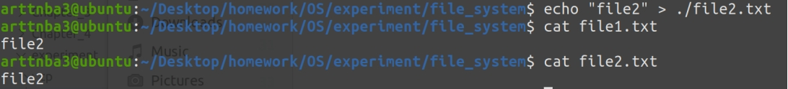

# 实验五、**文件系统**

## **一、实验题目**

The following exercise examines the relationship between files and inodes on a UNIX or Linux system. On these systems, files are represented with inodes. That is, an inode is a file (and vice versa). You can complete this exercise on the Linux virtual machine that is provided with this text. You can also complete the exercise on any Linux, UNIX, or Mac OS X system, but it will require creating two simple text files named file1.txt and file3.txt whose contents are unique sentences.

## **二、相关原理与知识**

**（完成实验所用到的相关原理与知识）**

Linux 文件系统相关知识

## **三、实验过程**

**（清晰展示实际操作过程，相关截图及解释）**

我们首先按照题目要求创建file1.txt和file3.txt这两个文件，并向其中写入不同的内容

 

随后使用ls命令查看file1.txt的相关信息，我们可以看到其 inode number 为 982859

 

接下来测试文件链接，在Linux下有着【硬链接】与【软链接】两种文件链接的方式：

- 对于硬链接文件而言，**其所对应的inode number相同，对任一文件的修改会影响所有文件，也就是说两个硬链接了的文件本身就是一个文件，只有当我们删除所有硬链接文件后该文件才会被删除**；

- 而对于软链接而言，链接文件仅仅是指向源文件，其与源文件inode不同，当源文件被删除之后链接文件则会失效

### 硬链接

我们使用如下命令创建一个 file1.txt的硬链接文件：

```shell
$ ln file1.txt file2.txt
```

可以看到，file1.txt与file2.txt拥有着相同的inode number

 

接下来我们向file2.txt中写入内容，可以看到，我们获取到的file1.txt的内容与此前已经不同了

 

接下来我们删除file1.txt，查看file2.txt的内容，我们可以发现无论是内容还是inode number都未曾发生改变

 

接下来我们删除file2.txt，并使用strace查看相关系统调用

 

略去前面加载动态链接库的那一大部分，我们主要关注其删除文件的流程，在这里使用了unlinkat这一个系统调用用以**从文件系统中删除一个名字，若是该名字为该文件的最后一个链接，则该文件将被标记为删除**，在这里我们可以看出在 Linux 的文件系统当中删除一个文件【本质上是从文件系统中删除掉一个对于特定inode关联的名字，当不存在与该inode相关联的名字时该inode被标记为删除，其对应文件所占用的空间恢复可用】

### 软链接

我们使用如下命令创建一个file3.txt的软链接文件：

```shell
$ ln -s file3.txt file4.txt
```

使用 ls -li 命令查看，我们可以发现file4.txt文件为file3.txt的软连接文件，其与file3.txt的inode number 并不相同，符合我们原本的推测

 

接下来我们尝试向 file4.txt 中写入内容，观察，我们发现file3.txt中内容同时被改变，这是由于文件链接的机制导致的，***\*我们对软链接文件的修改本质上是修改源文件\****，软连接文件的作用仅仅是作为对源文件的一个“索引”，在这里笔者认为或许可以类比为C语言中指针与指针所指向区域的关系

 

最后我们尝试删除file3.txt，这个时候我们发现当我们再次尝试获取file4.txt的内容时我们是无法获取到的，这是因为file4.txt所链接的源文件已经不存在了；接下来我们尝试向file4.txt中写入内容，我们发现***\*file3.txt会被重新创建，\****这也是由文件链接的机制所产生的结果


## **四、实验结果与分析**

在本次试验中，我们初步接触了Linux下的硬链接与软链接机制，初步了解到了这两种机制背后的原理，同时也初步领略到了Linux文件系统对于底层inode的封装的优雅所在

通过对unlinkat系统调用的初步了解，笔者得知在 Linux 的文件系统当中删除一个文件【本质上是从文件系统中删除掉一个对于特定inode关联的名字，当不存在与该inode相关联的名字时该inode被标记为删除，其对应文件所占用的空间恢复可用】

对于硬链接文件，在Linux内部的文件系统当中其有着相同的inode number；对于软链接文件，在Linux内部的文件系统中有着不同的inode number；

在Linux内部的文件系统**使用不同的inode number 标识不同的文件，而不是文件名**，多个不同的文件名可以对应同一个文件（inode number）